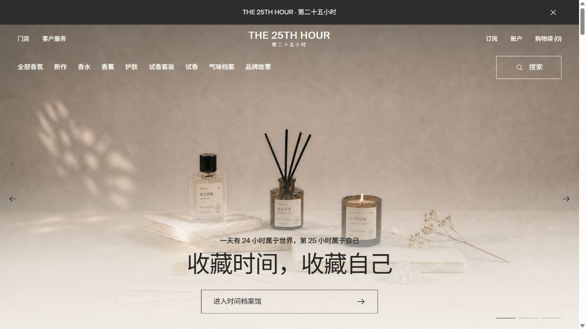

# THE 25TH HOUR香氛品牌官网

THE 25TH HOUR / 第二十五小时香氛品牌官网前端项目。网站围绕“第 25 小时属于自己”的品牌叙事，呈现香水、香氛、身体油与卸妆膏等产品内容。



## 在线演示

正在准备中。完成阿里云部署后，这里将添加正式访问地址。

## 网站内容

- 品牌首页与三组主视觉轮播
- 商品横向浏览、前后控制及商品图片悬停切换
- 随页面滚动变化的导航与分类菜单
- 搜索、购物袋与订阅界面交互
- 三问式选香器与可展开的试香体验
- 桌面端和移动端响应式布局，并兼容减少动态效果偏好

> 搜索、购物袋和订阅当前为前端交互展示，尚未接入订单、支付或邮件服务。

## 技术栈

- React
- TypeScript
- Vite
- CSS

## 本地运行

需要先安装 Node.js 与 pnpm。

```bash
pnpm install
pnpm dev
```

开发地址：`http://127.0.0.1:5173`

生产构建与本地预览：

```bash
pnpm build
pnpm preview
```

## 编辑内容

- 品牌名称、导航、主视觉、商品与文章数据：`src/data/site.ts`
- 页面结构和交互：`src/App.tsx`
- 设计变量、布局、响应式规则和动效：`src/styles.css`
- 字体、商品图和其他媒体素材：`public/assets/`
- 设计系统记录：`DESIGN.md`

每件商品使用两个图片字段：

- `image`：默认展示的场景图或包装图
- `hoverImage`：鼠标悬停或键盘聚焦时展示的正面商品图

建议将每款商品的图片存放在独立目录中，例如：

```text
public/assets/images/products/midnight-studio/
  scene.png
  product.png
```

## 版权

© 2026 THE 25TH HOUR. All rights reserved.

本仓库未授予开源使用许可。未经授权，不得复制、分发品牌名称、视觉素材与原创内容，或将其用于商业用途。
